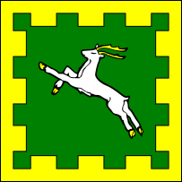
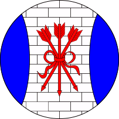
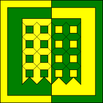
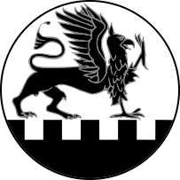

# populace-badges

## caer-galen-populace-badge.redrawn.svg

[SVG](caer-galen-populace-badge.redrawn.svg) | [PDF](caer-galen-populace-badge.redrawn.pdf)

## caerthe-populace-badge.redrawn.svg

[SVG](caerthe-populace-badge.redrawn.svg) | [PDF](caerthe-populace-badge.redrawn.pdf)

## nahrun-kabirun-populace-badge.redrawn.svg

[SVG](nahrun-kabirun-populace-badge.redrawn.svg) | [PDF](nahrun-kabirun-populace-badge.redrawn.pdf)

## outlands-populace-badge.redrawn.svg

[SVG](outlands-populace-badge.redrawn.svg) | [PDF](outlands-populace-badge.redrawn.pdf)

## plattefordham-populace-badge.redrawn.svg

[SVG](plattefordham-populace-badge.redrawn.svg) | [PDF](plattefordham-populace-badge.redrawn.pdf)

## unser-hafen-populace-badge.redrawn.svg

[SVG](unser-hafen-populace-badge.redrawn.svg) | [PDF](unser-hafen-populace-badge.redrawn.pdf)

## windkeep-populace-badge.redrawn.svg

[SVG](windkeep-populace-badge.redrawn.svg) | [PDF](windkeep-populace-badge.redrawn.pdf)

